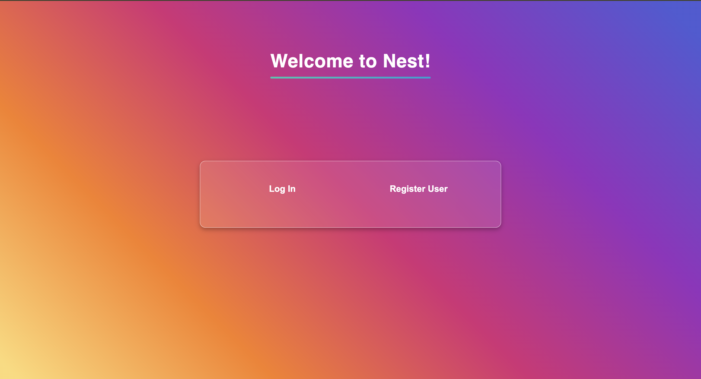
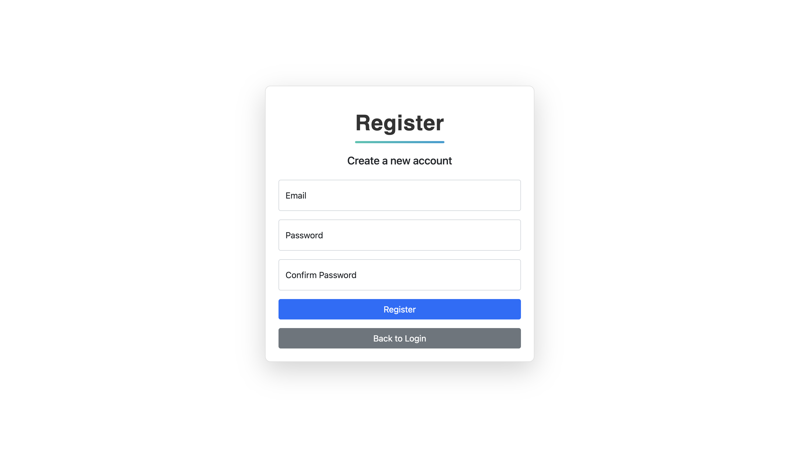
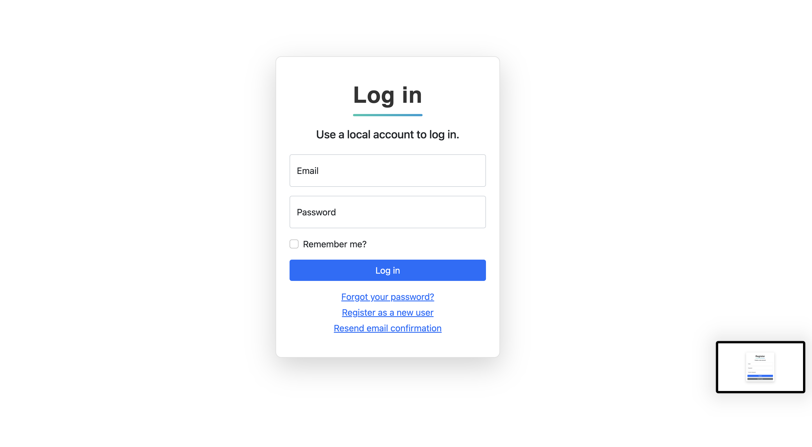
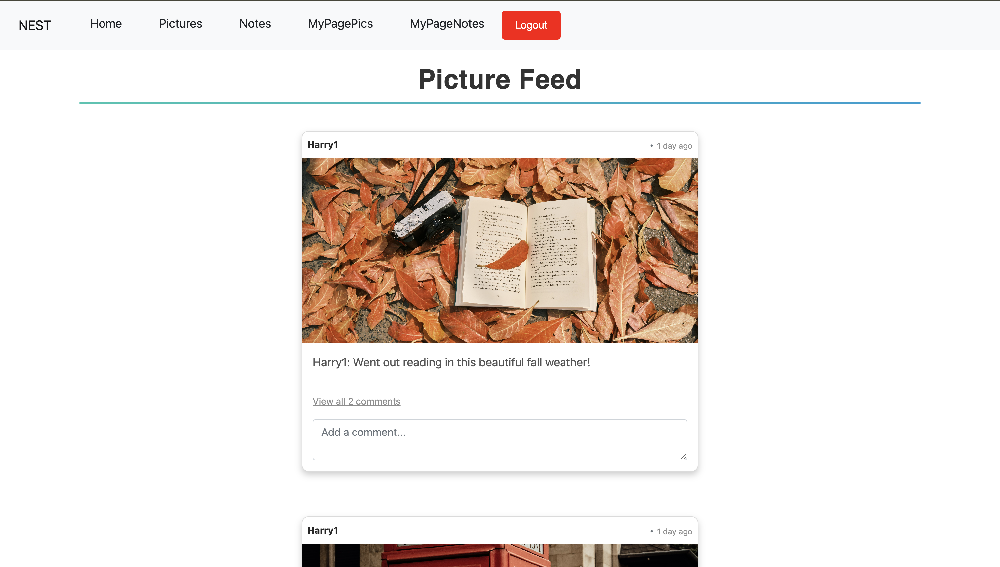
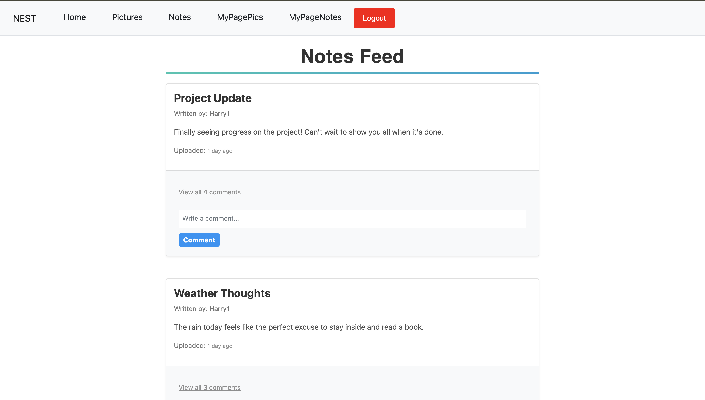
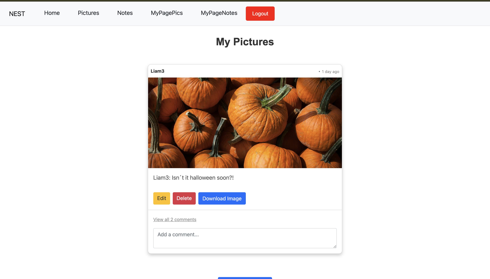
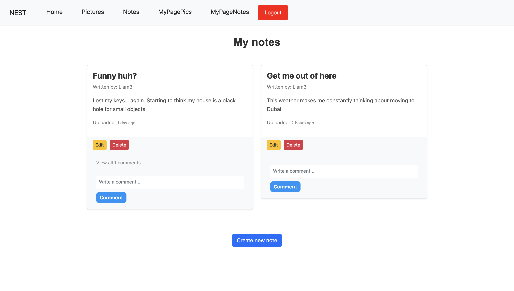

How to run the code:
In Terminal:

1. Open a new terminal and type in ‘cd Nest’
2. Type in ‘dotnet build’.
   If ‘build succeeded’
3. Type in ‘dotnet run’

Then you will receive a URL called “http://localhost:5161” which we click on while holding down the button “command” (macbook) or “control”(windows).

When directed to the login page, register new user or log in with
Email: Harry1@hotmail.com
Password: Styles1!

When logged in, explore the application by editing notes and captions. Try to delete picture, notes or comments.
Try posting something by downloading a picture on your computer and find the file by clicking the button on the site. Try publish a note and edit it if wanted.

Front page:

Register new user:

Log in:

Home page:

Pictures feed:

Notes feed:

Personal page for pictures:

Personal page for notes:

